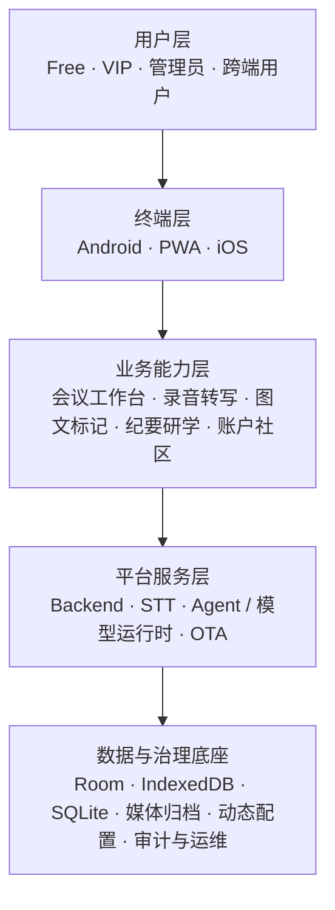

# MeetingNotesApp
+

## 项目事实速览

智悟本跨端会议采集、转写、图文证据和纪要系统镜像。

**运行与开发**：当前分支未核验到可靠的安装与启动入口，请先阅读目录和配置文件。

**边界与安全**：模型、第三方 API、支付渠道、桌面自动化、OCR 和外部数据源均受其自身授权、限额和兼容性约束；不要把演示数据或测试通过当作生产 SLA。禁止提交密钥、令牌、个人数据、模型文件和生产日志。许可证以仓库 LICENSE/NOTICE 及第三方组件声明为准。


智悟本是一套以 **Simple and effective** 为原则的会议采集、理解与成果管理系统：把录音、转写、图文证据、会议纪要、研学游记和跨端入口收纳在一条可恢复的工作流中。

## 当前版本

| 组件 | 当前口径 | 发布方式 |
|---|---|---|
| Android | `1.2.19`（`versionCode 10219`） | 服务器 OTA，应用登录或回到前台时检查 |
| Backend / STT | 仓库候选基线 `1.2.18`；生产部署基线独立记录 | Ubuntu 原生 Python 3.11 + systemd |
| PWA | 轻享版，同源 `/app/` 发布 | 浏览器安装到桌面 |
| iOS | SwiftUI 基础客户端 | Xcode / PWA 轻享版 |

Android 正式发布必须使用固定签名 Release APK。服务器 OTA 通道只保留最新版本和紧邻的一个旧版本，更新元数据与 APK 原子发布，并通过 SHA-256 校验后交给系统安装器。

## 产品边界



### 客户端

- **Android 主客户端**：完整录音、实时 STT、最终转写、图文标记、四类会议、研学分段、纪要生成、Word/PDF 导出、账户会员和 OTA。
- **PWA 轻享版**：认证、浏览器录音、文本/音频导入、最终转写、纪要、导出分享、IndexedDB 离线恢复和账户会议同步；后台录音受浏览器策略限制。
- **iOS 基础客户端**：SwiftUI、AVAudioRecorder、账户会话、最终 STT、Agent 纪要和运行时设置；能力覆盖仍低于 Android。

### 服务端

- **Backend Service**：账户注册/登录、Free 10 次试用、VIP 套餐、订单审批、短期 STT/Agent 凭证、账户隔离、社区能力、PWA 同源 API 和 Android OTA。
- **STT Service**：Faster-Whisper 本地模型、腾讯云混合 ASR、实时 WebSocket、文件识别、长音频动态分块、会话隔离、并发队列和音频归档。
- **Agent 网关**：服务端受控调用 Codex CLI / Claude CLI；客户端只保存运行时用户配置，不持有服务管理长期密钥。
- **数据与运维**：SQLite 业务数据、本地媒体归档、systemd、Nginx、健康检查、日志、备份恢复和版本回滚。

## 核心工作流

1. 用户创建快速会议、预定会议或文件导入会议。
2. Android 前台录音服务写入单一 WAV，同时可通过 WSS 获取实时预览。
3. 点击图文标记时记录文字锚点和时间戳，并立即拍照或从相册选择；图片完成后与对应文字绑定并闭合标记。
4. 停止录音后优先复用服务端已接收的音频生成最终稿，连接中断时回退完整文件上传。
5. Agent 根据四类会议和内容特征生成纪要；研学考察按暂停证据自动形成阶段稿，再汇总为总游记。
6. 纪要页面支持音频播放、图片管理、重新生成、继续录音、分享和 Word/PDF 导出。

## 会议类型与模板

- **通用会议**：覆盖行政会议、头脑风暴、杂谈和讲座沙龙；由 Agent 根据文本动态选择结构，不强行套固定模板。
- **项目管理**：面向项目进度、问题、决策、责任人、时间节点和行动项。
- **论坛会议**：突出主持人、主题演讲、圆桌讨论和现场问答，长音频由服务端动态分块和去重合并。
- **研学考察**：支持多段旅程、地点证据、照片、观察记录、阶段稿和总游记。

## 工程入口

| 工程 | 目录 | 说明 |
|---|---|---|
| Android | [`android/`](android/) | Kotlin、Jetpack Compose、Room v15、WorkManager |
| Server | [`server/`](server/) | FastAPI、Faster-Whisper、腾讯云 ASR、systemd 部署 |
| PWA | [`pwa/`](pwa/) | React/Vite，同源轻享版 |
| iOS | [`ios/`](ios/) | SwiftUI 基础客户端 |
| 设计系统 | [`design-system/`](design-system/) | 页面与组件视觉基线 |
| 架构文档 | [`docs/architecture/`](docs/architecture/) | 仓库内架构、发布和验证记录 |
| Git 辅助脚本 | [`git_shell/`](git_shell/) | Windows GitHub 仓库同步脚本 |

## 开发与验证

### Android

```powershell
cd android
.\gradlew.bat verifySigningConfig testDebugUnitTest assembleRelease
```

要求 JDK 17、Android SDK 34。正式签名配置位于用户私有目录 `${user.home}/.meetingnotes/signing.properties`，不提交 Git；公开 SHA-256 指纹登记在 `android/signing-fingerprints.properties`。

### PWA

```powershell
cd pwa
npm ci
npm run build
npm test
```

### Server

```bash
cd server
python -m pytest
```

生产部署使用 `server/deploy-remote.ps1`，所有主机、端口、路径、凭证、模型、并发和配额通过环境变量或分模块配置注入。

## 安全与配置原则

- 禁止在源码、README、文档、日志和 APK 中写入 API Key、密码、SSH 私钥或管理 Token。
- 服务地址、端口、目录、模型、超时、并发、配额和保留期必须使用环境变量、配置文件、运行时发现或依赖注入。
- Android 使用账户服务签发的短期用户凭证；云厂商和 Agent CLI 长期凭证只保存在服务端配置中。
- Room、IndexedDB、SQLite、媒体归档和 OTA 发布目录分别承担明确的数据权威与恢复职责。

## 相关资料

- Obsidian 项目总入口：`MeetingNotesApp（智悟本）/00-项目首页.md`
- Obsidian 总体架构：`MeetingNotesApp（智悟本）/04-架构与关系/01-总体架构.md`
- Obsidian 五层展开图：`MeetingNotesApp（智悟本）/04-架构与关系/01A-五层分层架构图.md`
