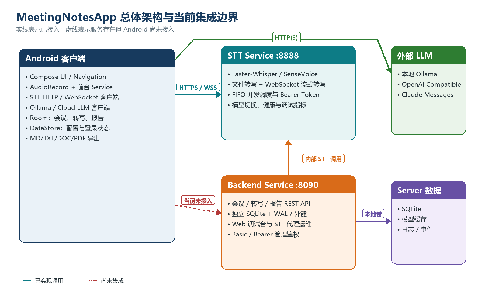
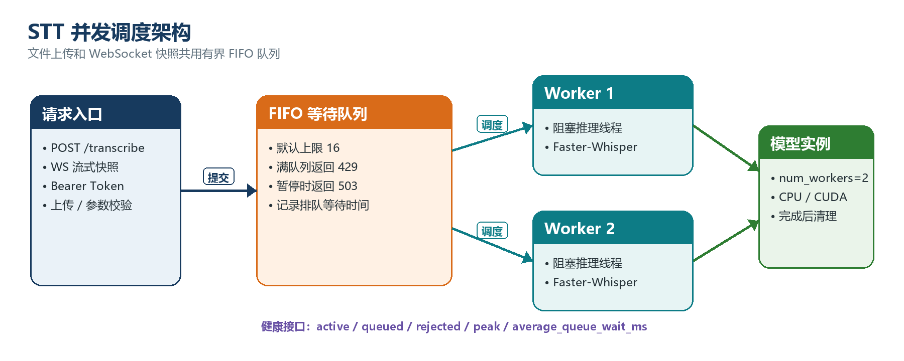

# 文档目的

本文说明 MeetingNotesApp Android 客户端与 Server 的关系，并详细记录 Server `1.0.0` 在 4 核、4 GB 内存、无 GPU、5 Mbps 带宽 Ubuntu 云服务器上的固定运行方案。

本版本不使用 Docker。生产运行方式固定为 Python 3.11 独立虚拟环境、systemd 服务、不可变发布目录和共享模型/配置/数据目录。

# 一、结论摘要

| 项目 | 固定结论 |
|---|---|
| 服务端主要职责 | STT 文件转写与 WebSocket 实时转写 |
| 默认启用服务 | STT Service |
| 可选服务 | Backend Service，Android 当前未接入，默认关闭 |
| STT 引擎 | Faster-Whisper |
| 模型 | `small` |
| 设备与计算精度 | CPU `int8` |
| 进程模型 | 1 个 Uvicorn 进程，只加载一份模型 |
| 推理并发 | 2 个活动任务 |
| 等待队列 | 16 个任务，有界 FIFO |
| Python | 3.11，依赖精确锁定 |
| 服务管理 | systemd 自动启动、异常重启、资源限制 |
| 内存上限 | `MemoryMax=3000M` |
| CPU 上限 | `CPUQuota=350%` |
| 发布方式 | Windows PowerShell 经 SSH 原子同步发布 |
| 模型一致性 | 4 个模型文件 SHA-256 校验 |
| 版本状态 | frozen；Ubuntu 实机验收已完成 |

## 1.1 生产实例

| 项目 | 当前值 |
|---|---|
| Ubuntu 地址 | `118.25.43.185` |
| STT 联调地址 | `http://118.25.43.185:8888` |
| 当前 frozen release | `1.0.0-20260716133109042` |
| 回滚 release | `1.0.0-20260716132511021` |
| 本地配置快照 | `server/.env.remote`，包含敏感 Token，不提交 Git |
| 本地发布记录 | `server/.deployment-state.json` |

当前使用 IP + HTTP 进行联调。Android 正式发布前仍应配置域名与 HTTPS/WSS。

# 二、Android 与 Server 总体关系



## 2.1 已经接通的关系

1. Android 通过 `POST /transcribe` 上传完整音频并取得最终文本。
2. Android 通过 `WS /ws/transcribe-stream` 上传 PCM 音频并取得实时预览。
3. Android 使用 Bearer Token 调用受保护的 STT 接口。
4. Android 直接调用 Ollama、OpenAI Compatible 或 Claude Messages LLM，不经过本项目 Server。
5. Android 使用 Room 保存会议、转写和报告数据。

## 2.2 尚未接通的关系

1. Android 尚未调用 Backend Service 的会议、转写和报告 API。
2. Android Room 与 Server SQLite 相互独立，不存在业务数据自动同步。
3. 当前所谓“本地和服务端同步”是源码、发布版本、模型和生产配置同步。
4. Android 登录仍是本地状态，不是 Server 账号或多租户身份系统。

# 三、Server 功能点

## 3.1 文件转写

| 功能点 | 实现状态 | 说明 |
|---|---|---|
| 多格式上传 | 已实现 | WAV、M4A、MP3、MP4、AAC、OGG、FLAC、WebM |
| 分块上传落盘 | 已实现 | 每块 1 MB，不一次性读取整个文件 |
| 文件大小限制 | 已实现 | 生产默认 128 MB，超限返回 413 |
| 空文件校验 | 已实现 | 返回 400 |
| 临时文件清理 | 已实现 | 成功、失败、取消后清理 |
| 过期文件治理 | 已实现 | 只清理服务前缀且超过时限的文件 |
| 最终转写结果 | 已实现 | JSON 返回文本与识别语言 |
| 幻觉短语过滤 | 已实现 | 已知固定幻觉短语会被过滤 |

## 3.2 WebSocket 实时转写

| 功能点 | 实现状态 | 说明 |
|---|---|---|
| start/stop 控制事件 | 已实现 | 建立参数与结束会话 |
| PCM 二进制音频 | 已实现 | 支持采样率与声道校验 |
| partial 预览 | 已实现 | 周期性滑动窗口推理 |
| committed 文本 | 已实现 | 稳定帧提前提交并去重合并 |
| 质量过滤 | 已实现 | 平均对数概率与无语音概率 |
| fail-open | 已实现 | 连续过滤时避免预览长期卡死 |
| 缓冲上限 | 已实现 | PCM 缓冲按最大快照时长截断 |
| 会话上限 | 已实现 | 生产默认 12 个在线流会话 |
| 调试事件 | 已实现 | 有界内存缓冲，可查询和清空 |

## 3.3 并发调度



调度器不是单线程一次只服务一个用户。文件转写和流式快照进入同一个有界 FIFO 队列，最多 2 个任务同时进入模型推理。

| 状态 | 行为 |
|---|---|
| 活动任务少于 2 | 立即进入推理 |
| 活动任务已满且队列未满 | 按 FIFO 等待 |
| 等待任务达到 16 | HTTP 返回 429，并带 `Retry-After` |
| 模型切换维护 | 暂停接收新推理，返回 503 |
| 调用方取消 | 已接受任务完成清理，避免临时文件泄漏 |

历史版本曾评估 SenseVoice，但当前生产代码已移除 FunASR 依赖和 SenseVoice 分支，统一使用 Faster-Whisper；旧客户端配置在升级时迁移到默认模型。

## 3.4 鉴权和运维接口

| 接口 | 鉴权 | 用途 |
|---|---|---|
| `GET /health` | 无 | 版本、模型、设备、队列、流和临时文件指标 |
| `GET /ready` | 无 | 模型成功加载后返回 200 |
| `POST /transcribe` | Bearer | 文件转写 |
| `WS /ws/transcribe-stream` | Bearer | 实时转写 |
| `POST /admin/stt/switch` | Bearer | 模型/引擎切换 |
| `GET/DELETE /debug/stream-events` | Bearer | 流调试事件 |

生产配置设置 `STT_REQUIRE_API_TOKEN=1`，Token 为空时服务直接拒绝启动。

## 3.5 可选 Backend Service

Backend 已实现会议、转写、报告 REST API、SQLite WAL、外键、级联删除、稳定报告 upsert 和 Web 调试台。但 Android 当前没有调用它，因此默认不启用，避免占用 4 GB 主机的内存和 CPU 预算。

# 四、固定生产架构

```text
Android App
    |
    | HTTP / WebSocket + Bearer Token
    v
Ubuntu 公网端口 8888
    |
    v
meetingnotes-stt.service (systemd)
    |
    +-- Python 3.11 专属 venv
    +-- FastAPI / Uvicorn 单进程
    +-- FIFO 调度器：active=2, queue=16
    +-- Faster-Whisper small / CPU int8
    +-- /var/lib/meetingnotes-stt/models
    `-- /var/lib/meetingnotes-stt/tmp
```

## 4.1 为什么只使用一个服务进程

多个 Uvicorn 进程会分别加载模型，直接放大模型和推理状态内存。在 4 GB 主机上，正确做法是一个 Uvicorn 进程、一份模型，由应用内部的 Faster-Whisper worker 和 FIFO 调度器实现并发。

## 4.2 systemd 资源与安全限制

| 限制 | 值 | 目的 |
|---|---:|---|
| `MemoryHigh` | 2700 MB | 提前产生内存回收压力 |
| `MemoryMax` | 3000 MB | 避免 STT 挤占整台主机 |
| `CPUQuota` | 350% | 给 SSH、systemd和系统进程保留 CPU |
| `TasksMax` | 128 | 限制线程/进程数量 |
| `LimitNOFILE` | 8192 | 限制文件描述符 |
| `NoNewPrivileges` | true | 禁止获取新增权限 |
| Capability | 空 | 服务不持有 Linux capability |
| 文件系统 | `ProtectSystem=strict` | 系统与发布目录只读 |
| 可写目录 | `/var/lib/meetingnotes-stt` | 仅模型、临时文件和可选数据库 |

# 五、发布目录与同步关系

```text
/opt/meetingnotes-stt/
|-- releases/1.0.0-时间/    不可变源码
|-- venvs/1.0.0-时间/       对应固定依赖
|-- current                 当前源码链接
|-- previous                上一源码链接
|-- current-venv            当前 venv链接
`-- previous-venv           上一 venv链接

/var/lib/meetingnotes-stt/
|-- models/                 跨版本共享模型
|-- tmp/                    临时音频
`-- backend/                可选 SQLite

/etc/meetingnotes-stt/stt.env
/var/backups/meetingnotes-stt/
```

Windows `deploy-remote.ps1` 每次生成唯一发布 ID，上传源码并调用远端安装器。成功后：

1. 远端 `/health` 返回同一 `version` 和 `release`。
2. 本地 `server/.deployment-state.json` 记录服务器、版本、发布 ID 和时间。
3. 远端 `/etc/meetingnotes-stt/stt.env` 同步为本地 `server/.env.remote`。
4. 模型仅首次上传；后续先校验 SHA-256，一致则跳过。
5. `.env.remote`、部署记录、模型和数据均被 Git 忽略。

# 六、一键部署流程

## 6.1 Windows 到 Ubuntu

```powershell
cd <项目根目录>\server
.\deploy-remote.ps1 `
  -ServerHost 服务器IP `
  -Port 22 `
  -User 部署用户 `
  -KeyPath C:\Users\你的用户名\.ssh\id_ed25519 `
  -OpenFirewall
```

发布脚本只使用公钥 SSH。不要把密码、私钥内容或 Token 发到聊天中。

## 6.2 Ubuntu 本机

```bash
cd server
bash deploy-ubuntu.sh
```

安装器会校验主机、安装 Python 3.11 与 ffmpeg、安装精确锁定依赖、验证模型、备份旧状态、切换版本并等待健康检查。

# 七、备份、恢复与回滚

## 7.1 一致性备份

```bash
sudo bash /opt/meetingnotes-stt/current/scripts/backup-native.sh
```

SQLite 使用标准在线 backup API，不直接压缩正在变化的 WAL文件。归档包含生产配置和可选 Backend 数据库，默认保留 30 天。

## 7.2 恢复数据

```bash
sudo bash /opt/meetingnotes-stt/current/scripts/restore-native.sh 备份文件.tar.gz
```

恢复脚本拒绝归档中任何超出配置和 Backend 数据目录的路径，避免路径穿越或覆盖发布源码。

## 7.3 回滚程序版本

```bash
sudo bash /opt/meetingnotes-stt/current/scripts/rollback-native.sh
```

回滚会交换 current/previous 与对应 venv，恢复后执行模型、依赖、systemd 和健康验证。

# 八、验证结果

| 验证项 | 结果 |
|---|---|
| Python `py_compile` | 通过 |
| Server 单元测试 | 10/10 通过 |
| Python 3.11.15 固定依赖安装 | 38 个核心包安装成功 |
| `pip check` | 无依赖冲突 |
| 固定版本核心导入 | ctranslate2 4.8.1、FastAPI 0.139.0、Faster-Whisper 1.2.1、Uvicorn 0.51.0 |
| 模型 SHA-256 | 通过 |
| 空 Token 生产保护 | 已实现 |
| 无 Token 文件转写 | HTTP 401 |
| 有 Token 文件转写 | HTTP 200 |
| 6 请求并发 | 全部 HTTP 200 |
| 调度峰值 | `peak_active=2`、`peak_queued=4` |
| 20 请求突发 | 18 个完成、2 个队满返回 429、0 失败 |
| Ubuntu STT cgroup | 约 760-816 MB，MemoryMax 3 GB、CPUQuota 350% |
| 双向 release 回滚 | 两个独立 release 往返成功 |
| 备份与恢复 | 生产配置归档、恢复及重启验证成功 |
| 本机模型加载工作集 | 约 455-675 MB，平台指标仅作参考 |
| Bash 脚本语法 | 通过 `bash -n` |
| PowerShell 脚本语法 | 0 parse errors |

Ubuntu 22.04 实机已完成安装、首次启动、systemd 服务重启、cgroup 资源观测、鉴权、并发、队满 429、双向回滚、备份恢复和公网连通性验证。未执行整台云主机重启，以免影响该主机现有桌面、浏览器和其他业务进程；服务已设置为 systemd enabled。

# 九、冻结条件

Server `1.0.0` 已按下列条件标记为 frozen：

1. Ubuntu 版本和主机资源通过预检。
2. systemd 服务成功启动，`/ready` 和 `/health` 正常。
3. 模型 SHA-256 与本地清单一致。
4. 六请求并发测试无失败，峰值并发为 2。
5. `systemctl restart` 后自动恢复；systemd 开机启用已确认，整机重启因同机其他业务未执行。
6. `MemoryMax`、`CPUQuota`、`TasksMax` 生效。
7. 故障版本部署能够自动回退。
8. 手工备份与恢复验证通过。
9. 公网客户端使用同一服务地址和 Token 完成文件转写；Android 端到端调用留给后续客户端开发。
10. 本地 `.deployment-state.json` 与远端 `/health.release` 一致。

# 十、后续开发边界

Server 冻结后，后续迭代优先集中于 Android：

1. 稳定录音与后台服务生命周期。
2. 网络中断重试、队满 429 退避和上传进度。
3. 5 Mbps 网络下的音频压缩和分段上传。
4. HTTPS/WSS 域名接入和证书校验。
5. UI、纪要生成、模板、导出和本地数据体验。
6. 是否接入 Backend 业务同步需单独设计账号、租户、冲突合并与安全模型，不在 STT `1.0.0` 冻结范围内。

# 十一、部署所需 SSH 元数据

实际部署只需要：

- 服务器 IP 或域名
- SSH 端口
- SSH 用户名
- 本地私钥文件路径
- 该账户是否具备临时免密 sudo
- Ubuntu 版本
- 是否已有域名用于 HTTPS/WSS

不需要也不应提供 SSH 密码和私钥内容。
