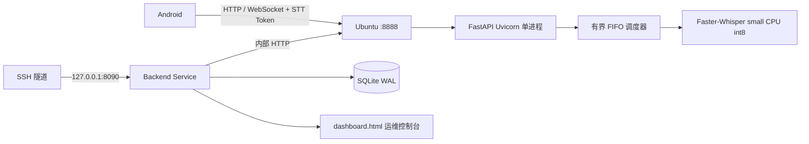

# MeetingNotesApp Server 1.0.2

## 1. 当前生产实例

| 项目 | 值 |
|---|---|
| 服务器 | `118.25.43.185` |
| 系统 | Ubuntu 22.04 x86_64 |
| 资源 | 4 核、约 4 GB 内存、无 GPU、5 Mbps |
| 部署方式 | 原生 Python 3.11 + systemd，不使用 Docker |
| 当前 release | `1.0.2-20260716223958510` |
| STT 公网地址 | `http://118.25.43.185:8888` |
| Backend 监听地址 | `0.0.0.0:8090` |
| Backend 公网地址 | `http://118.25.43.185:8090/web` |
| 当前状态 | STT 与 Backend 均 `enabled + active` |

当前远端已按需求绑定 `0.0.0.0:8090`，可直接使用公网 URL：`http://118.25.43.185:8090/web`。也可以使用 SSH 隧道访问本机回环地址：

```powershell
ssh -F NUL `
  -i "$HOME\.ssh\meetingnotes_stt_118_25_43_185" `
  -L 8090:127.0.0.1:8090 `
  ubuntu@118.25.43.185
```

然后打开：`http://127.0.0.1:8090/web`

鉴权：用户名 `admin`，密码读取本地 `server/.env.remote` 的 `WEB_API_TOKEN`。不要把 Token 写入笔记、截图或聊天内容。

## 2. 架构关系



Android 当前已接入 STT，但尚未接入 Backend 的会议/报告 API。Backend 数据库和 Android Room 仍然独立，不会自动同步。

## 3. 已实现功能

### STT Service

- Faster-Whisper 文件转写和 WebSocket 实时转写。
- `small` 模型、CPU `int8`、启动时模型 SHA-256 校验。
- 2 个推理并发槽位，每个槽位 2 个 CPU 线程。
- 最多 16 个等待任务，队满返回 429 和 `Retry-After`。
- partial、committed、stop 事件和有界流式调试事件缓存。
- Bearer Token 鉴权、临时文件限制和过期清理。
- 引擎切换前停止接单、排空任务并执行受控重启。
- `/health` 返回模型、并发、排队、拒绝、峰值和平均等待指标。

### Backend Service

- FastAPI 服务和 SQLite 数据层。
- `meetings`、`transcripts`、`reports` 表，外键、级联删除、WAL、忙等待和事务回滚。
- 会议、转写、报告 REST API，报告支持稳定 ID upsert。
- Bearer Token 和 `admin` HTTP Basic 鉴权。
- 通过内部 HTTP 读取 STT 健康、切换引擎和清理流式事件。
- Backend 健康接口：`GET /health`。

### Web 运维控制台

- 独立模板：`server/backend-service/dashboard.html`。
- 深色侧栏、浅色工作区、紧凑指标卡和表格化信息布局，视觉方向参考 Material Kit。
- Backend/STT 健康卡、当前引擎/模型、队列和活跃推理指标。
- 当前配置、手机端 STT 地址、数据库路径和日志路径展示。
- Faster-Whisper / SenseVoice 切换按钮。
- 最近会议表格、partial 摘要、流式事件查看器、STT 日志查看器。
- 日志/事件清理操作和页内通知。
- 桌面和 390px 手机宽度响应式布局。

## 4. 资源与安全边界

| 项目 | 固定值 |
|---|---:|
| STT `MemoryMax` | 3000 MB |
| STT `CPUQuota` | 350% |
| STT `TasksMax` | 128 |
| Backend `MemoryMax` | 384 MB |
| Backend `CPUQuota` | 25% |
| STT 推理并发 | 2 |
| STT 等待队列 | 16 |

- STT 8888 供 Android 调用；当前 Backend 8090 已开放公网以便观测台访问。
- 当前公网观测台仍为 HTTP，正式使用应接入 HTTPS，并限制云安全组来源 IP。
- Backend 日志文件：`/var/lib/meetingnotes-stt/logs/stt.log`，归属 `meetingnotes:meetingnotes`，权限 `0640`。
- STT 与 Backend 使用独立 Token；Token 不进入源码和 Obsidian。
- 当前仍是共享 Token 和全局 SQLite，尚未实现用户、租户隔离和细粒度权限。

## 5. 发布与回滚

Windows 工作区发布：

```powershell
cd <项目根目录>
.\server\deploy-remote.ps1 `
  -ServerHost 118.25.43.185 `
  -Port 22 `
  -User ubuntu `
  -KeyPath "$HOME\.ssh\meetingnotes_stt_118_25_43_185" `
  -WithBackend `
  -SkipPackages
```

生产目录：`/opt/meetingnotes-stt/current` 指向当前不可变 release；`current-venv` 指向版本专属 Python 环境；模型、SQLite 和日志位于 `/var/lib/meetingnotes-stt`。

常用命令：

```bash
sudo systemctl status meetingnotes-stt.service
sudo systemctl status meetingnotes-backend.service
sudo bash /opt/meetingnotes-stt/current/scripts/verify-native.sh
sudo bash /opt/meetingnotes-stt/current/scripts/backup-native.sh
sudo bash /opt/meetingnotes-stt/current/scripts/rollback-native.sh
```

## 6. 验收结果

- 本地服务端测试：11 项通过。
- 固定 Windows Python 运行时编译检查通过。
- 远端 STT `ready`、`health` 通过，模型校验通过。
- 远端 STT 与 Backend 均 `enabled + active`。
- 控制台无鉴权返回 401，Basic Auth 返回 200。
- 远端控制台桌面和 390px 移动宽度均返回 200，Backend/STT 状态均显示正常，页面无脚本错误。
- `/api/debug/stt-log` 返回 200，日志权限问题已在 1.0.2 修复。
