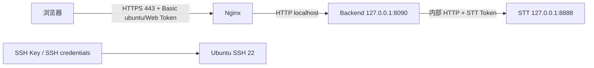

# MeetingNotesApp Server 1.0.3 HTTPS 与 Web 认证

## 当前访问方式

| 项目 | 值 |
|---|---|
| 当前 release | `1.0.3-20260716232915822` |
| 公网控制台 | `https://118.25.43.185/web` |
| Backend 进程 | `127.0.0.1:8090`，不再公网监听 |
| HTTPS 入口 | Nginx `0.0.0.0:443` |
| Web 用户名 | `ubuntu` |
| Web 密码 | 本地 `server/.env.remote` 中的独立 `WEB_API_TOKEN` |
| SSH 登录 | 仍使用 SSH key/服务器凭据，与 Web Token 分离 |

`0.0.0.0` 仅作为 Nginx 的监听地址，不是浏览器访问 URL。浏览器应访问 `https://118.25.43.185/web`。

## 安全设计



- Web Basic 用户名配置项为 `WEB_API_USERNAME`，当前值 `ubuntu`。
- Web 密码仍是 `WEB_API_TOKEN`，不会复用 Ubuntu SSH 密码，也不会读取系统账户密码。
- 这样可以单独轮换 Web Token，而不影响 SSH 登录、密钥和服务器账户。
- Backend 8090 仅监听 `127.0.0.1`；即使云安全组仍有旧规则，也没有服务在公网 8090 接收请求。
- Nginx 只代理 `/web`、`/health` 和 `/api/*` 到 Backend。

## HTTPS 证书与续期

- 证书为 Let’s Encrypt 公网 IP 证书，SAN 包含 `118.25.43.185`。
- `snap.certbot.renew.timer` 已配置。
- `certbot renew --dry-run` 已成功。
- 续期 deploy hook 会执行 `systemctl reload nginx`。

## 验收结果

| 检查 | 结果 |
|---|---|
| Nginx | `enabled + active` |
| Backend | `enabled + active` |
| 公网 HTTPS `/web` 匿名 | 401 |
| 使用旧 `admin` | 401 |
| 使用 `ubuntu` + Web Token | 200 |
| 页面 STT/Backend 状态 | 正常 |
| 证书校验 | 客户端 HTTPS 校验通过 |
| 续期演练 | 成功 |

## 运维

```bash
sudo systemctl status nginx
sudo nginx -t
sudo systemctl status meetingnotes-backend.service
sudo snap run certbot renew --dry-run
```

Web Token 不写入 Markdown、Word、截图或聊天；仅在本地忽略文件 `server/.env.remote` 和远端 `/etc/meetingnotes-stt/stt.env` 保存。
