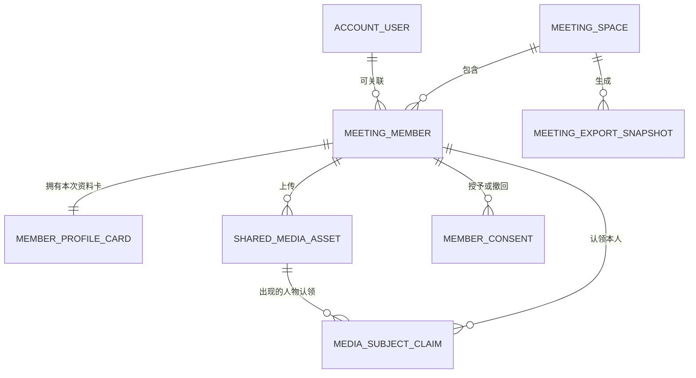

> [!info] 文档定位
> 本文是决策前的产品与架构方案，不代表当前已实现能力，不直接承诺版本、工期、容量或商业价格。后续只有在产品范围、隐私规则和试点规模确认后，才拆分 PRD、API、数据库迁移和研发任务。

# 智悟现场：会议影像共创与参会图谱方案

## 一、方案摘要

建议为智悟本新增一个独立能力域，产品名暂定为 **智悟现场**。

它不是普通的“会议共享相册”，而是把三条原本分离的链路组合起来：

1. **内容流**：参会者通过二维码共同上传照片、视频片段、白板、名牌和文字见闻。
2. **身份流**：参会者自主填写并确认姓名、单位、职务和头像，形成可授权的参会名录。
3. **证据流**：主持人把已确认的人物和精选影像绑定到议程、转录时间点或研学行程段，进入纪要和正式导出快照。

建议使用以下产品表达：

| 层级 | 推荐名称 | 说明 |
|---|---|---|
| 总能力 | 智悟现场 | 会议协作空间总称 |
| 影像区 | 现场拾光 | 多人上传、时间线和精选相册 |
| 人员区 | 同席名录 | 头像墙、组织分组和参会名单 |
| 联系能力 | 智悟名片 | 字段级授权和双方名片交换 |
| 纪要能力 | 影像证据 | 照片与转录、议程、行动项的可追溯关联 |
| 大屏模式 | 现场之窗 | 只读实时照片墙和会议信息展示 |

一句话定位：

> **让会议不只留下声音和文字，也留下共同参与的人、现场发生的事，以及可以被核验的过程。**

## 二、调研结论

### 2.1 图片直播与共享相册

Piufoto 的参考相册体现了图片直播产品的典型结构：二维码或短链接进入、相册分类、双列瀑布流、实时刷新、上传者或摄影师信息、热度和下载能力。页面还包含身份、搜索、摄影师、人脸检索提示、表单和肖像权举报等配置线索。

Kululu 的官方页面进一步验证了二维码活动相册的核心价值：

- 参会者无需下载应用或注册，通过链接或二维码进入。
- 参与者可共同上传照片、视频、文字和说明。
- 上传结果可以实时进入照片墙，在电视或投影仪展示。
- 主持人可统一下载，活动空间默认按受邀范围访问。

Apple Shared Albums 体现了另一组成熟规则：创建者控制成员，参与者上传可单独开关，创建者可以删除任意贡献内容，贡献者可以删除自己上传的内容，新增内容可触发通知。它适合熟人协作，但依赖 Apple 账户和系统生态，不适合作为智悟现场的跨平台扫码入口。

### 2.2 会议社交与参会者目录

Cvent Attendee Hub 等会议平台把以下能力视为活动体验的一部分：参会者资料、个性化议程、预约交流、互动、签到信息、参会行为洞察，以及邀请制或隐藏活动。其思路说明，相册只能回答“现场发生了什么”，参会目录还要回答“谁参加了、以什么身份参加、是否愿意建立联系”。

智悟本不宜照搬大型会展平台的营销与线索采集逻辑。智悟现场应优先服务会议纪要、考察归档和可信参会名录，再逐步加入双方自愿的联系能力。

### 2.3 合规与人脸能力

《中华人民共和国个人信息保护法》要求个人信息处理具有明确、合理目的，采用对个人权益影响最小的方式；生物识别、行踪轨迹等属于敏感个人信息，处理敏感个人信息需要特定目的、充分必要性和更严格保护。

《人脸识别技术应用安全管理办法》自 2025 年 6 月 1 日起施行。官方答记者问明确指出，存在其他非人脸识别技术方式可以实现同等目的时，不应把人脸识别作为唯一验证方式，并要求履行告知和个人信息保护影响评估等义务。

因此首版推荐：

- 使用“本人认领照片 + 名牌 OCR 预填 + 主持人确认”。
- OCR 只生成候选字段，不能自动确认身份。
- 不存储人脸特征向量，不以人脸检索作为加入会议或查看照片的必要条件。
- 后续即使评估人脸聚类，也必须单独授权、可关闭、可撤回，并与基础会议功能解耦。

## 三、与当前智悟本架构的关系

### 3.1 当前可复用能力

截至 2026-08-06，源码已经具备下列基础：

- Android 账户资料已有昵称和头像，可作为参会资料卡的预填来源。
- `MeetingAttachment` 已记录会议、行程段、本地图片、时间及可选 GPS/EXIF 线索。
- `Journey`、`JourneyStage`、阶段稿和总游记可以承载分段式考察活动。
- 社区模块已经实现图片重编码、缩略图、SHA-256、分片续传、WorkManager/Outbox、失败恢复、服务端二次元数据净化、配额、审核和举报。
- PWA 已具有独立前端工程、认证、本地会议、录音、云同步和导出基础，可以承载扫码访客页面，但访客入口应按路由拆包，不加载完整工作台。
- 纪要完成页已有参会头像区域，但当前参会者实际上只取会议发起人。

### 3.2 不能直接复用的部分

- `MeetingRecord.participants` 仍是 `List<String>`，不能表示身份来源、单位、职务、头像、确认状态和授权范围。
- `MeetingAttachment` 是主持人手机里的本地证据，不具备多人上传、服务端所有权和审核语义。
- `community_posts` 表达“个人发布的公开内容快照”，不应承担私密会议协作空间。
- 当前社区媒体配额按账户计算；活动相册应按会议空间或组织计算，并区分原始素材、展示派生图和正式导出快照。
- 当前公开社区图片 URL 的可见性规则不适用于私密会议影像。

### 3.3 架构决策

> [!success] 推荐决策
> 新增独立的 `MeetingSpace` 领域。复用社区媒体上传的算法和基础设施，但不复用社区帖子及其所有权模型。`MeetingAttachment` 只作为主持人确认后同步到本机会议的投影。

## 四、目标用户与角色

| 角色 | 主要能力 | 默认限制 |
|---|---|---|
| 主持人/空间所有者 | 创建空间、生成二维码、设置规则、审核身份与照片、精选内容、关闭或归档空间 | 不能代替成员授予联系方式公开或人脸分析同意 |
| 协作管理员/摄影人员 | 分类、上传官方照片、审核普通内容、维护议程 | 不能修改空间所有权和高敏感隐私配置 |
| 实名参会者 | 加入名录、维护本次会议资料卡、上传、认领本人照片、交换名片、撤回自己的授权 | 只能看到其权限范围内的名录和影像 |
| 访客上传者 | 免注册上传并管理自己本设备提交的内容 | 默认不进入名录、不查看联系方式、不浏览私密全量人员资料 |
| 只读观看者 | 查看主持人允许公开的照片墙 | 不能上传、认领人物或进入通讯录 |

首版产品界面可以只显式呈现“主持人、实名参会者、访客上传者”三类，协作管理员和只读观看者作为权限配置保留。

## 五、会议全生命周期

### 5.1 会前

1. 主持人在预定会议或会议详情中开启“智悟现场”。
2. 设置加入模式、上传开始/截止时间、内容是否先审后显、名录可见范围和原图保留期。
3. 生成二维码、短链接和可下载的会场立牌图。
4. 可选导入预期参会名单，生成待确认成员，而不是直接认定实际到会。
5. 可选创建议程或考察行程段，作为照片分类和后续纪要证据边界。

### 5.2 会中

1. 参会者用微信、QQ、飞书或系统浏览器扫码。
2. 首屏只展示会议名称、主办方、隐私摘要，以及“实名加入”和“仅上传”两个动作。
3. 实名加入时可拍摄名牌，OCR 预填姓名、单位和职务，由本人逐项确认。
4. 参会者上传现场照片、人物照、白板、资料或文字见闻，可选择当前议程/行程段。
5. 新内容进入增量照片流；开启“先审后显”时，只有通过审核的缩略图进入共享区和大屏。
6. 用户可在照片上执行“这是我”“申请隐藏我”“补充说明”，不能自动给其他人物命名。
7. Android 录音时间轴与照片拍摄/上传时间对齐，主持人可把照片关联到某段转录或重点标记。

### 5.3 会后

1. 主持人关闭加入和上传，但可以继续审核、整理和精选。
2. 系统形成参会名录草稿：已确认到会、待确认、仅受邀未到会必须分开。
3. 系统按议程或行程段生成影像时间线，聚合同一时刻的多视角照片。
4. 主持人选择进入纪要的人员和图片，生成不可漂移的 `MeetingExportSnapshot`。
5. Word/PDF 可加入参会人员表、精选现场图、图注、来源阶段和影像附录。
6. 参会者可在保留期内下载本人允许范围的内容、撤回资料展示或发起删除/肖像权请求。
7. 原图按空间策略到期清理；正式纪要引用的派生图按组织归档策略单独保存。

## 六、页面与交互构思

### 6.1 Android 主持人端

建议入口保持“Simple and effective”：

- 预定会议详情：`开启智悟现场`
- 会议录音页更多菜单：`智悟现场`
- 录音页仅在空间开放时显示一个紧凑状态，例如“现场 23 人 · 86 张”，不增加大块卡片。
- 会议完成页：参会头像区域进入完整“同席名录”；会议图片区域进入“现场拾光”。

空间管理页建议分为四个页签：

| 页签 | 内容 |
|---|---|
| 概览 | 二维码、短链接、人数、照片数、待审核数、空间开关 |
| 影像 | 最新、待审核、精选、议程/行程段分类、批量操作 |
| 同席 | 头像墙、组织分组、身份确认、名录导出 |
| 设置 | 加入方式、可见性、上传窗口、保留期、删除与归档 |

### 6.2 扫码 H5

扫码页必须是独立轻量路由，例如 `/s/{shortCode}`，优先适配微信、QQ、飞书内置浏览器和 iPhone Safari。

建议底部只有四个入口：

- `现场`：增量照片流和议程筛选
- `上传`：中心主操作，支持相机、多选和文字见闻
- `同席`：按授权展示的参会头像墙
- `我的`：资料卡、我的上传、我的认领和撤回授权

首次进入不强迫注册。访客会话由二维码邀请码换取会议范围内的短期令牌，并在本设备保存可恢复的访客身份。

### 6.3 现场大屏

`现场之窗` 是只读展示模式：

- 照片墙或单图轮播
- 会议名称、当前议程、照片数量
- 可选显示二维码和投稿提示
- 默认只显示审核通过、允许大屏展示的内容
- 不显示手机号、微信号等联系字段

首版可使用带游标的 3 至 5 秒增量轮询，兼容性通常优于强依赖 WebSocket；后续可增加 SSE，并保留轮询回退。刷新周期由服务端动态配置。

## 七、关键创新点

### 7.1 声音与影像的同一时间轴

照片不只是报告附件。系统可用拍摄时间、上传时间、录音开始时间和人工标记，把照片定位到转录上下文附近，例如：

> 15:32 拍摄的白板照片，对应 15:30 至 15:35 的方案讨论。

系统只给出候选关联，主持人确认后才成为正式证据。这样可以从纪要中的某个议题跳回现场照片，也可以从照片查看当时的转录片段。

### 7.2 名牌即资料卡，确认而非猜测

参会者拍摄自己的名牌，OCR 预填字段，原图默认在确认后删除或进入短期受控区。字段必须由本人确认，主持人只能标记“会议已核验”，不能把 OCR 结果当作事实。

### 7.3 照片认领替代首版人脸识别

参会者主动点击“这是我”，再由主持人或照片上传者确认。该机制能形成“人物到照片”的关系，同时让参与者知道自己出现在哪些照片里，并拥有隐藏或删除申请入口。

### 7.4 多视角时刻

同一时间、同一议程下的相似照片可以通过时间、图像感知哈希和构图相似度形成“多视角时刻”。它用于折叠重复内容和挑选清晰代表图，不用于识别人物身份，也不跨会议做全局画像。

### 7.5 同席图谱而非静态名单

参会名录可提供三种视图：

- 头像墙：快速建立人物印象。
- 组织视图：按单位、部门和角色分组。
- 行程视图：研学考察中显示每个阶段实际参与和贡献内容的成员。

不根据同框次数或发言次数自动推断关系。后续可以加入本人自愿填写的“关注方向”和“希望交流”，形成主题连接图。

### 7.6 纪要共识回签

后续版本可让参会者仅确认与自己相关的结构化内容，例如姓名、单位、本人行动项或发言摘录。它不是多人直接改写正式纪要，而是向主持人提交确认或异议，最终仍由主持人生成新版本快照。

### 7.7 个人隐私视图

“我的”页面应集中展示：

- 我提供了哪些资料
- 我上传了哪些照片
- 哪些照片标记了我
- 哪些字段对谁可见
- 哪些照片进入了正式纪要或公开社区
- 我可以撤回什么、申请删除什么

这比在冗长协议里一次性勾选更容易建立信任。

## 八、授权与隐私模型

“进入会议空间”不能等同于同意全部处理。建议采用版本化、分目的授权：

| 授权项 | 推荐默认值 | 说明 |
|---|---|---|
| 上传内容所需处理 | 必选 | 仅覆盖上传、存储、审核和会议内展示 |
| 加入参会名录 | 主动选择 | 仅上传访客无需加入 |
| 展示头像/姓名/单位/职务 | 字段级选择 | 可只显示姓名或匿名简称 |
| 展示联系方式 | 默认关闭 | 推荐双方交换名片后可见 |
| 照片进入正式纪要 | 单独授权或会议明确告知 | 与会议内临时展示分开 |
| 照片进入公开社区/宣传 | 默认关闭，单独同意 | 不能由会议内上传授权推导 |
| OCR 处理名牌 | 单独说明 | 确认后按策略删除名牌原图 |
| 人脸特征处理 | 首版不存在 | 后续若启用必须独立开关和影响评估 |

可见范围建议支持：`仅本人`、`主持人`、`已确认参会者`、`双方交换后`、`受邀观看者`、`公开`。

撤回后的处理原则：

- 未来页面和未来导出停止展示已撤回字段。
- 未生成正式快照的数据可以删除或匿名化。
- 已下载到第三方设备的文档无法远程召回，授权页面必须提前说明。
- 正式档案若因合法业务需要保留，应限制访问并保留处理依据，不继续用于宣传或推荐。

## 九、领域模型

### 9.1 核心实体

| 实体 | 关键职责 |
|---|---|
| `MeetingSpace` | 会议协作空间、所有者、生命周期、策略和配额 |
| `MeetingInvite` | 二维码/短链、权限范围、有效期、撤销和使用限制 |
| `MeetingMember` | 账户用户或访客在本次会议中的身份与状态 |
| `MemberProfileCard` | 本次会议的姓名、单位、职务、头像等历史快照 |
| `MemberConsent` | 授权目的、版本、范围、授予与撤回时间 |
| `SharedMediaAsset` | 上传者、媒体类型、哈希、派生图、所属阶段和审核状态 |
| `MediaSubjectClaim` | “这是我”等人物认领及确认状态 |
| `NameBadgeObservation` | 名牌图片、OCR 候选字段、确认人和清理状态 |
| `MeetingAlbumCategory` | 议程、考察点、官方/人物/白板等分类 |
| `MeetingContactExchange` | 名片交换请求、同意、撤回和字段范围 |
| `ModerationDecision` | 身份、图片和说明的审核记录 |
| `MeetingExportSnapshot` | 正式纪要引用的成员、照片、授权和来源版本快照 |

### 9.2 必须分开的身份关系



上传者不等于照片中的人物，照片中的人物不一定是注册用户，注册用户的全局资料也不应直接覆盖历史会议资料卡。

### 9.3 生命周期

建议空间状态：

`DRAFT -> OPEN -> LOCKED -> ARCHIVED -> PURGED`

- `OPEN`：按策略允许加入、上传和查看。
- `LOCKED`：停止加入/上传，仍可审核和整理。
- `ARCHIVED`：只读归档，等待保留期或组织策略处理。
- `PURGED`：原始媒体已清理，只保留必要审计或匿名统计。

加入、上传、名录可见和大屏展示应是独立开关，不能只靠一个总状态表达。

## 十、服务端与媒体架构

### 10.1 领域边界

建议在现有 Backend 中先增加独立模块，而不是首批拆微服务：

```text
account_service      账户与主持人会话
meeting_space        空间、邀请、成员和授权
collaboration_media  媒体清单、分片、派生图和审核
meeting_projection   已确认人员/图片向 Android 会议投影
export_snapshot      正式纪要证据快照
```

社区和智悟现场可以共享底层图片净化、哈希、分片协议和存储适配器，但数据库表、权限检查、配额和公开规则保持独立。

### 10.2 媒体处理链

```text
客户端建立媒体清单
-> 分片上传或对象存储直传
-> 完整 SHA-256 校验
-> MIME 嗅探与解码验证
-> 提取允许的拍摄时间候选
-> 清除 EXIF/XMP/IPTC/GPS
-> 生成展示图、缩略图和头像裁剪图
-> 内容审核/主持人审核
-> 对有权限的客户端签发短期访问 URL
```

建议区分三类资产：

- `private-original`：私有原始文件，最短必要保留。
- `meeting-display`：去元数据、压缩后的会议内展示图。
- `export-snapshot`：进入正式纪要的固定派生图。

同一会议内可以用 SHA-256 和感知哈希做去重或折叠；不建议首版跨会议全局去重，以免删除权、授权和所有权相互牵连。

### 10.3 存储演进

| 阶段 | 建议方案 | 适用范围 |
|---|---|---|
| 小规模试点 | 当前 SQLite + 抽象后的本地媒体目录 | 功能验证，不承诺大型活动容量 |
| 团队试用 | PostgreSQL + S3 兼容对象存储/MinIO | 多会议并发、稳定权限与审计 |
| 大型活动 | PostgreSQL + 对象存储直传 + CDN/图片处理服务 | 数百人、数千张照片和大屏访问 |

对象存储可适配腾讯云 COS、MinIO 或其他 S3 兼容服务，但产品 UI 只显示“智悟现场存储”。提供者、区域、桶、签名时效、容量、分片和并发参数必须来自环境变量或模块配置文件。

### 10.4 实时更新

首版推荐游标增量接口：

`GET /api/spaces/{id}/feed?after={cursor}&limit={n}`

优点是内置浏览器兼容性好、断线恢复简单，也与参考图片直播页面的周期刷新模式相符。后续可以提供 SSE：

`GET /api/spaces/{id}/events`

客户端断线或代理不支持时回退游标轮询。照片二进制不通过事件通道发送，只发送资源 ID、状态和缩略图描述。

## 十一、邀请与安全

二维码中只放随机短码，不放账户令牌、数据库 ID 或长期签名。推荐流程：

```text
扫码短码
-> 服务端校验空间、时效、撤销和速率限制
-> 展示会议与隐私摘要
-> 用户选择实名加入或仅上传
-> 换取限定 meeting_space_id 和 capability 的短期访客令牌
```

安全要求：

- 服务端只保存邀请码摘要，支持立即撤销和重新生成。
- 访客令牌只允许本会议内的明确操作。
- 上传按空间、设备、IP 和时间窗口限速。
- 校验文件魔数、像素尺寸、解码结果、大小和分片哈希。
- 管理员操作写入审计记录；批量删除需要二次确认。
- 私密媒体不提供永久公开 URL，使用授权接口或短期签名 URL。
- 防止二维码被转发后无限扩散，可选设置入场口令、名单匹配、最大成员数或主持人批准。
- 所有时效、额度、并发和保留期均动态配置，不写死到 APK 或 PWA。

## 十二、API 草案

API 名称仅用于明确边界，实施前需单独形成 OpenAPI 契约。

### 主持人接口

- `POST /api/account/meeting-spaces`
- `GET /api/account/meeting-spaces/{spaceId}`
- `PATCH /api/account/meeting-spaces/{spaceId}`
- `POST /api/account/meeting-spaces/{spaceId}/invites`
- `POST /api/account/meeting-spaces/{spaceId}/lock`
- `GET /api/account/meeting-spaces/{spaceId}/moderation`
- `POST /api/account/meeting-spaces/{spaceId}/moderation/{itemId}`
- `POST /api/account/meeting-spaces/{spaceId}/export-snapshots`

### 扫码与成员接口

- `GET /api/meeting-invites/{shortCode}`
- `POST /api/meeting-invites/{shortCode}/exchange`
- `POST /api/meeting-spaces/{spaceId}/members`
- `PATCH /api/meeting-spaces/{spaceId}/me/profile-card`
- `PUT /api/meeting-spaces/{spaceId}/me/consents/{purpose}`
- `POST /api/meeting-spaces/{spaceId}/contact-exchanges`
- `DELETE /api/meeting-spaces/{spaceId}/me`

### 媒体接口

- `POST /api/meeting-spaces/{spaceId}/media`
- `PUT /api/meeting-spaces/{spaceId}/media/{mediaId}/{variant}`
- `GET /api/meeting-spaces/{spaceId}/feed`
- `DELETE /api/meeting-spaces/{spaceId}/media/{mediaId}`
- `POST /api/meeting-spaces/{spaceId}/media/{mediaId}/claims`
- `POST /api/meeting-spaces/{spaceId}/media/{mediaId}/privacy-requests`

所有写接口使用客户端幂等键。成员修改、授权和正式导出使用版本号或 ETag，避免后写覆盖主持人刚完成的确认。

## 十三、纪要、研学和社区融合

### 13.1 普通会议

- 已确认参会人员进入纪要人员表。
- 精选图片可绑定议题、决策、白板或行动项。
- 导出时可生成“会议影像附录”，图片编号与正文引用一致。
- 报告生成使用确认后的结构化资料，不让 Agent 从照片自行猜测姓名或单位。

### 13.2 参观考察

- `JourneyStage` 对应展馆、项目点、路段或交流环节。
- 每段拥有独立的参与成员、照片、讲解人物和阶段说明。
- 多设备照片按阶段汇聚，阶段稿引用已确认图片，总游记再引用阶段稿快照。
- GPS 只作为本人允许的阶段候选，不向其他成员公开精确轨迹。

### 13.3 社区发布

会议空间始终默认私密。发布到社区必须执行新的发布动作：

1. 从会议空间选择内容。
2. 生成去身份化或经明确授权的发布快照。
3. 重新确认隐私和图片权利。
4. 进入现有社区审核流程。

不能因为照片已在会议空间展示，就自动获得公开发布或宣传使用权。

## 十四、质量、配额与运营

### 14.1 图片质量辅助

AI 或传统算法可以提示：模糊、过暗、重复、疑似截图、白板、名牌或多人合照。它只能辅助整理，不能以“颜值”“重要人物”等主观标签排序。

### 14.2 配额模型

建议配额按空间和组织管理：

- 原图总容量
- 单文件大小
- 总媒体数量
- 单访客上传速率
- 展示图与缩略图容量
- 空间开放时长和保留期

具体数值由服务端配置和商业套餐决定，不进入方案硬编码。主持人应在创建空间前看到预计容量，并在接近上限时收到明确提示。

### 14.3 审核策略

支持三档：

- `直接展示`：适合内部小会，仍保留举报和主持人删除。
- `机器初筛后展示`：拦截不可解码、明显违规或含风险信息的内容。
- `主持人审核后展示`：适合公开活动、大屏和外部人员较多的会议。

名牌、证件、联系方式截图默认不进入大屏和普通照片流，应进入受限资料处理区。

## 十五、商业与应用场景构思

| 场景 | 核心价值 | 可形成的专业能力 |
|---|---|---|
| 内部项目会 | 人员、白板、现场和行动项统一归档 | 私密空间、纪要证据、组织名录 |
| 行政会议 | 准确到会名单和时间节点 | 签到确认、人员表、节点照片 |
| 头脑风暴/沙龙 | 保留现场观点和互动氛围 | 观点照片、文字见闻、主题连接 |
| 参观考察 | 分段汇聚不同成员视角 | 行程段、讲解人、影像游记 |
| 工程巡检/监理例会 | 现场照片与问题闭环 | 时间地点、责任项、整改前后对照 |
| 大型论坛/交流会 | 快速收集和展示大量现场影像 | 二维码投稿、审核、大屏、参会图谱 |

商业上可以形成团队版或活动空间包，但不建议首版按“上传一张照片消耗一次 AI 额度”。存储、OCR、AI 策展和公开大屏应分别计量，套餐参数由服务端配置。

## 十六、分阶段路线

### 阶段 0：产品验证与原型

- 确认目标是内部会议优先还是大型活动优先。
- 做扫码首屏、上传、照片流、同席名录和主持人审核的可点击原型。
- 用 10 至 30 人真实会议验证扫码成功率、上传意愿、字段填写率和隐私接受度。
- 完成个人信息保护影响评估初稿和数据清单。

### MVP：可信共创空间

- 主持人创建/关闭空间和二维码邀请。
- 免注册访客上传、实名参会者资料卡。
- 图片清单、分片续传、缩略图、净化和审核。
- 增量照片流、我的上传、删除和举报。
- 头像墙、基础参会名录和 Android 参会人员投影。
- 不做联系方式公开、名牌 OCR、人脸识别和公开社区联动。

### V1：影像与纪要融合

- 名牌 OCR 预填与本人确认。
- 照片认领、隐私请求和主持人确认。
- 议程/行程段、声音影像时间轴和多视角折叠。
- 纪要人员表、正文图片引用和影像附录。
- 现场大屏、精选相册和正式导出快照。

### V2：交流与组织能力

- 智悟名片、双方交换和字段级可见性。
- 关注方向、希望交流和组织视图。
- 纪要相关内容回签与异议处理。
- 团队空间、协作管理员、对象存储和审计导出。

### V3：受控智能增强

- 经合规评估后再决定是否提供可选人脸聚类。
- 聚类只在单一会议内工作，不建立跨会议人物画像。
- 必须提供同等可用的非人脸替代方式、单独授权、关闭、撤回和删除。

## 十七、工作量与技术风险

基于当前已有社区上传、账户、PWA 和纪要基础，完整 MVP 仍不是一个小功能。单人全职开发的粗略量级为 6 至 8 人周，另需 UI 审核、真机兼容、部署、隐私文本和试点时间。名牌 OCR、纪要证据链和现场大屏预计再增加 3 至 5 人周。该估算只用于方案比较，不能替代拆分后的研发评估。

主要风险：

| 风险 | 表现 | 应对 |
|---|---|---|
| 免登录滥用 | 二维码外泄、垃圾上传 | 短期访客令牌、撤销、限速、口令和审核 |
| 大图并发 | Backend 带宽、SQLite 写锁、磁盘快速增长 | 存储抽象、压力测试、对象存储直传、PostgreSQL 演进 |
| 人物误认 | OCR 错字、他人冒认、AI 猜测 | 本人确认、主持人核验、来源状态、禁止自动定论 |
| 联系方式泄露 | 通讯录截图或批量导出 | 默认隐藏、双方交换、导出权限、水印和审计 |
| 肖像权争议 | 他人上传人物照 | “我在其中”入口、隐藏/删除申请、公开发布重新授权 |
| 历史漂移 | 用户改头像后历史名单变化 | 会议级资料卡和导出快照 |
| 内置浏览器兼容 | 微信/iOS 上传、缓存、断网恢复差异 | 轻量 H5、增量续传、真机矩阵和轮询回退 |

## 十八、推荐的首版产品决策

> [!success] 当前推荐
> 1. 主打 20 至 100 人的内部会议、沙龙和参观考察，架构保留大型活动演进空间。
> 2. 扫码上传不要求注册；进入同席名录需要主动填写并确认资料。
> 3. 名录默认只向已确认参会者开放，基础字段和联系方式分开授权。
> 4. 联系方式默认隐藏，优先采用双方交换名片后可见。
> 5. 内容默认会议内私有；大屏、正式纪要、社区公开分别取得权限。
> 6. 首版采用名牌 OCR 候选、本人认领和主持人确认，不做人脸识别。
> 7. 原始照片采用可配置短期保留；纪要精选图形成独立固定快照。
> 8. 首版以增量轮询确保微信、QQ、飞书和 Safari 兼容，后续再增加 SSE。

## 十九、待产品负责人确认的问题

1. 第一目标场景是内部项目/行政会议，还是数百人的论坛和活动？
2. 访客是否允许浏览全部会议照片，还是只能上传和查看已精选内容？
3. 同席名录是仅主持人可见、全体已确认参会者可见，还是由会议逐次设置？
4. 联系方式采用双方交换模式，还是允许成员主动公开部分字段？
5. 主持人是否必须逐张审核，还是内部会议允许先展示后处置？
6. 原图的推荐默认保留期采用 7 天、30 天还是由组织模板决定？
7. 正式纪要中的人物照片，采用会议级统一告知，还是逐人逐图确认？
8. 是否需要把“签到/实际到会”纳入首版，还是只做参会资料与照片共创？

## 二十、验收指标建议

产品试点不以“上传总量越多越好”为唯一目标。建议观察：

- 扫码进入成功率
- 首张照片上传完成率和平均耗时
- 参会资料本人确认率
- 主持人处理待审核内容所需时间
- 纪要参会人员准确率
- 精选照片与转录阶段关联的有效率
- 隐私撤回和删除请求的完成时效
- 会议结束后主持人实际导出或回看比例
- 因二维码、上传失败、误认或权限造成的投诉数量

## 二十一、调研来源

- [Piufoto 参考图片直播相册](https://m.piufoto.com/album/78fe51dd6b46bc3becacf8851fab9896/1305445553?from=qrCode&menu=live)
- [Kululu Event Photo Sharing with QR Code](https://www.kululu.com/)
- [Apple Support: How to use Shared Albums](https://support.apple.com/en-us/108314)
- [Cvent: AI-Powered Event App / Attendee Hub](https://www.cvent.com/en/event-marketing-management/mobile-event-apps)
- [中华人民共和国个人信息保护法，中国人大网](http://www.npc.gov.cn/npc/c2/c30834/202108/t20210820_313088.html)
- [国家法律法规数据库：中华人民共和国个人信息保护法](https://flk.npc.gov.cn/detail?id=ff8081817b6472a3017b656cc2040044)
- [人脸识别技术应用安全管理办法，中国政府网](https://www.gov.cn/zhengce/zhengceku/202503/content_7016075.htm)
- [《人脸识别技术应用安全管理办法》答记者问](https://www.gov.cn/zhengce/202503/content_7016082.htm)

## 相关笔记

- [[10-项目/01-产品研发/MeetingNotesApp（智悟本）/00-项目首页|项目首页]]
- [[10-项目/01-产品研发/MeetingNotesApp（智悟本）/01-项目总览/02-定位与边界|项目定位与边界]]
- [[10-项目/01-产品研发/MeetingNotesApp（智悟本）/01-项目总览/05-产品版本展望与软硬件协同路线|产品版本展望与软硬件协同路线]]
- [[10-项目/01-产品研发/MeetingNotesApp（智悟本）/02-Android端/04-会议图片与结构化DOCX|会议图片与结构化 DOCX]]
- [[10-项目/01-产品研发/MeetingNotesApp（智悟本）/02-Android端/11-参观考察游记模板|参观考察模板]]
- [[10-项目/01-产品研发/MeetingNotesApp（智悟本）/04-架构与关系/01-总体架构|总体架构]]
- [[10-项目/01-产品研发/MeetingNotesApp（智悟本）/04-架构与关系/02-会议端到端流程|会议端到端流程]]
- [[10-项目/01-产品研发/MeetingNotesApp（智悟本）/04-架构与关系/04-模板注册库与私有RAG|模板注册库与私有 RAG]]
