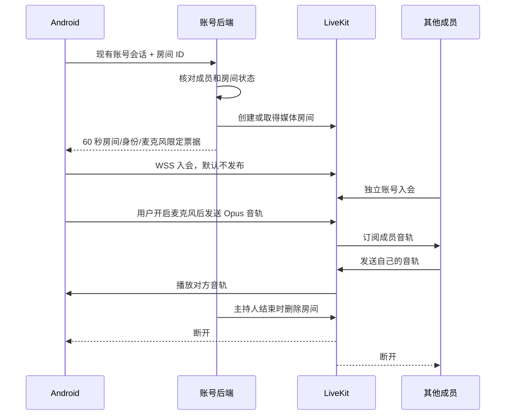

# 聆听·策划会：多人语音通话（2026-09-19）

## 本阶段结果

自有会议房间已增加真实语音通话代码，采用 LiveKit：Android SDK 2.20.2，媒体服务基线 1.13.7。复用已有微信/普通账号登录，不接腾讯会议 SDK，也不读取微信、电话等第三方通话。当前状态为代码完成、本机双客户端音频验证通过，尚未部署生产或发布 OTA。

## 用户流程与 UI

1. 在聆听·策划会的房间入口创建或加入九位会议号。
2. 后端配置通话服务后，点击“加入通话 · 默认静音”。申请麦克风权限；Android 12+ 同时申请蓝牙连接权限，拒绝蓝牙不阻止使用手机音频。
3. 通话卡片显示连接/重连状态、实际音频设备、已连接成员和发言/静音状态；点击“开启麦克风”才发布音轨。
4. 关闭弹窗、返回首页或切后台不主动断线。前台服务保留通知，支持静音/离开；点击通知可直接打开通话控制弹窗。
5. “离开通话”仅关闭当前媒体连接，房间成员关系保留。主持人“结束房间”关闭整个媒体房间。切换账号或账号服务地址时退出原通话。

继续沿用纸张/书签页面，通话控件只增加在房间弹窗内，默认 8 dp 按钮和 12 dp 弹窗圆角。采用现有 Android Compose 技能的状态、中文文案和紧凑布局要求；依用户指示未进行手机或模拟器验收。

## 调用关系

## 生命周期与边界

- SDK 负责 WebRTC/Opus、重连和音频设备接入；App 不另开一个录音器去获取通话音频。音频增强/回声消除的真实硬件表现还需人工验收。
- 本机录音与房间通话共用 `AudioSessionGate`。录音启动/通话建立期间也占锁；异常或退出释放。未完成录音包含暂停状态，需先完成或暂存，才可进入通话。原有“暂停后切换另一条本机录音”的流程不受影响。
- Android 通话期间每 5 秒检查房间身份/状态；结束/退房立即在下一次检查退出，连续 3 次接口失败退出。SDK 自身处理短暂网络重连。
- 账号后端发票据，不向客户端发媒体管理密钥；不把票据写入日志/数据库。退出/删除账号的媒体清理写入持久队列，每 5 秒重试，删除级联触发清理。现版本清理期间持有 SQLite 写事务，媒体接口采用有限超时；大规模部署需改进并发清理对账户库写入的影响。
- `media_ready` 只表示后端配置齐全，不表示外网或 TURN 可达；真实入会会调用媒体服务验证。
- 必须关闭 LiveKit 自动建房（`room.auto_create: false`），以避免已结束房间被旧票据重新创建。已退出成员的旧票据仍可能在 60 秒内重新连入尚开放的媒体房间；目前没有逐票据即时撤销能力，不能宣传为完全即时服务端撤权。
- **当前通话不录制、不转写。** 页面明确告知。房间语音不能靠原有“本机麦克风转写”覆盖，下一阶段需要服务端按成员音轨接入 STT、统一时间轴、录音意愿校验和共享纪要。
- 本阶段没有视频、屏幕共享、跨设备共享稿件、实时 AI 对话、耳机私密播报；现有外部录音导入仍走原路径。

## 验证证据

- Android JVM：412 项，0 失败/错误/跳过；Debug 构建、Lint 与固定证书校验通过。新增测试覆盖默认静音、麦克风切换失败、录音互斥、重复入会、迟到事件、账号/端点切换、结束房间与持续同步失败。
- Lint 沿用现有工具链，部分依赖自带的旧版自定义检查因 API 不兼容被跳过；构建成功不代表这些检查已经执行。本轮未扩大到 Gradle/Compose 工具链升级。
- 后端：13 项媒体专项测试 + 14 项账户路由回归通过，覆盖 JWT 签名/权限、权限隔离、入会与结束/退房竞态、持久清理、账号删除及错误脱敏。
- 实际媒体验证：本机 LiveKit 1.13.7 + 两个 Python RTC 客户端通过 WebRTC/Opus 交换合成 PCM 音频。双方分别接收 171/172 帧，其中 171/79 帧为非零音频（第二方包含静音测试时段）；静音/恢复、结束断开双方、旧票据拒绝重开均通过。
- 4.141 秒是“启动临时服务、创建房间、两端顺序入会和取得双向音频”的总耗时，**不是音频端到端延迟**。未测公网通话延迟、手机回声、蓝牙效果或蜂窝网络稳定性。
- 测试二进制下载包 SHA-256 与官方 checksums 一致：`e539e7d2f75807b9c9202cd2a0bf2cb3d52fc4c52978a6953e0f47bc339fe77f`。测试完成已关闭媒体进程并清理临时房间/随机凭据。
- 可重跑脚本：`server/scripts/verify_room_audio.py`；部署模板与网络说明：`server/rtc-service/`。测试没有使用手机、模拟器、麦克风或真实会议录音。

## 下一阶段

接入“房间成员音轨 → V100 STT → 带身份与时间范围的共享转录 → 聆听·策划会纪要”。每条音轨已有明确成员身份，优先保留成员身份；多人共用一个麦克风时再补匿名声学说话人分离。仍需单独部署公网 WSS/UDP/TCP/TURN 并由用户验收设备，之后才发布正式签名 OTA。

原回退基线 `lite-baseline-1.2.87-20260919` / `2cda38c8` 保留；当前生产版本未变更。Obsidian 只用于研发记录，不属于 App 功能或运行依赖。
