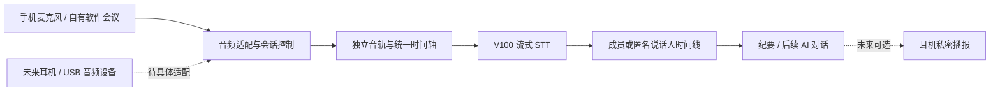

# 聆听·策划会：软件主链路与耳机扩展契约

日期：2026-09-19。当前决策：软件方案继续完成，硬件作为可选输入与交互扩展，二者共用 STT、时间线和纪要能力。Obsidian 仅用于研发记录，不是产品功能。

## 双路线与当前范围

| 路线 | 当前落点 | 后续工作 |
| --- | --- | --- |
| 纯软件 | Android 自有音频房间、按成员订阅音轨、V100 流式协议、共享转录和纪要代码 | 生产 RTC/V100/Agent 联调、容量实测、人工手机网络验收及正式 OTA |
| 软件＋耳机 | 现有系统蓝牙音频路由；本阶段增加通用 PCM/时间映射边界和设备接入契约 | 确认耳机规格，制作具体适配器，验证双向采音、按键和私密播报 |

没有耳机也能使用软件方案。没有型号和协议前，不引入厂商 SDK，不显示不可用的“硬件连接”功能，不将接口预留描述为硬件实装。微信只用于账号登录；目前不读取微信、腾讯会议或电话的内部音频，不开发替代它们的完整视频会议产品。

图中虚线和“后续 AI 对话”是预留方向。硬件只负责采集、音频处理、控制或输出；本阶段不要求耳机或手机运行大模型，模型继续在 V100/既有 Agent 服务执行。设备断开也不能让后台偷偷开启另一种采集来源。

## 当前软件流程

1. 用户以普通账号或微信登录进入自有房间，加入语音通话默认静音，显式开启麦克风才发布音轨。
2. 当前房间成员全部同意录音与转写后，由主持人点击“开始转写”。通话与转写独立控制，暂停转写不会挂断通话。
3. 账号后端的可选转写工作进程以隐藏、只订阅的参与者接入 LiveKit。每位成员音轨转为 16 kHz、单声道 PCM16LE，分别连接 V100。
4. 成员在“转录与共享纪要”中查看时间范围、成员显示名和增量正文；客户端只在弹窗处于前台时轮询，关闭界面不停止服务端转写。
5. 主持人暂停后进入“正在保存最后一句”，尾句完成才允许生成纪要。继续转写沿用原时间轴，新音轨订阅有独立片段身份，避免覆盖旧内容。
6. 生成纪要冻结当时的转录快照并保存请求 ID，调用已有 Agent 网关及账号额度；重复点击不重复排队或扣费。生成新稿先清空旧正文，结果只能写回对应请求。成员读取同一份服务端纪要。
7. 成员撤回同意或新成员未同意时，立即拒绝新转录写入并停止订阅；已经获得的文字保留。账号删除级联删除其转录和关联共享稿，成员快照变化让客户端重新拉取，避免保留旧副本。

当前持久化的是转录、时间和纪要，不提供房间原始音频归档、音频回放、共享稿协同编辑或共享稿 PDF 导出。个人即刻倾听/顷刻成稿的原路径不受影响。

## 音频与硬件接入契约 v1

已实现并被房间转写实际使用：`server/backend-service/audio_ingress.py` 中的 `PcmFrame` 和 `AudioClock`。这是采样数据与时间映射边界，不是远程硬件 HTTP 接口。

| 输入/事件 | 契约 | 当前状态 |
| --- | --- | --- |
| 音频帧 | PCM16LE、16 kHz、单声道；严格递增序号；会话相对结束时间 | 已实现，RTC 适配器使用 |
| 时间映射 | 模型采样偏移映射至会话时间，保留静音/断连间隙 | 已实现，近似接收时间；不是字级对齐 |
| 会话归属 | 由已登录账号绑定 session/track/member，不能相信设备自报身份 | 当前房间由服务端成员表绑定 |
| 能力声明 | 麦克风、上下行分轨、格式、采样率、标记键、私密播放、电量、离线缓存 | 契约预留，须真实查询设备再启用 UI |
| 控制 | 开始、暂停、继续、标记；带 command ID 和确认结果 | 复用现有录音状态机；硬件协议尚未实现 |
| 设备状态 | 连接/断开、实际输入输出路由、电量、错误、缓存进度 | 系统音频路由已有；厂商遥测待实现 |
| 双向音轨 | 本人麦克风与对方播放流分轨，分别标注来源和时钟 | 仅当硬件明确提供且验证后支持 |
| 本地缓存补传 | 序号、采集时间、断点、去重；补传进入历史段，不能冒充实时 | 未来适配器能力，当前无此设备实现 |
| 私密播报 | 有用户明确开启与独立输出路由；播报不得回灌为会议输入 | 待设备和音频回声路径验证 |

未来适配器负责解码/重采样、校时、断连和设备协议；STT 与纪要层继续复用。耳机命令仍须经过 App 的会话状态与用户意愿校验，不能绕过“正在录音”的互斥或替用户同意转写。设备固件升级与账号数据存储也应分开。

普通蓝牙 HFP/系统音频路由可以让 App 使用耳机麦克风，但不保证 App 能获取第三方通话的对方音频。BLE 控制通道不等于可用的实时音频通道。定制前需供应商明确说明：Android 支持方式、USB/Bluetooth 音频协议、上下行数据可访问性、采样质量、按钮事件、同时播放/录音、时钟、断连与缓存能力。

## 说话人与情绪功能的界限

自有会议每条音轨已有账号身份，优先展示“成员显示名：内容”；这不是声纹实名验证。多人共用设备时，应在该轨道内增加匿名“说话人 1/2”，与成员名分层保存。现有个人 STT 的说话人分离开关保持原逻辑，本阶段房间音轨明确关闭重复声学分离，避免再次整场识别。

情绪理解与实时 AI 对话是后续应用层。当前共享纪要只整理文本中可核对的观点、共识、分歧和行动，不能根据文本编造音高、语速、真实情绪或意图。未来若增加互动提示，需保留依据、时间定位、推测属性和用户纠正入口；耳机播报是输出渠道，不提高推断本身的可信度。

## 可靠性与部署边界

- 共用已有账户会话，不给普通用户增加手工令牌配置。工作进程租约、run ID、片段唯一键、修订号和纪要 request ID 用于避免并发重复写入。
- WebSocket/媒体异常明确暂停并保留已得文字，不无限重试。每轨最多缓存约 2 秒未发送音频，积压时失败提示，不悄悄丢帧或积累几分钟延迟。
- 模型暂停刷新最长等待约 5 秒。时间为接收估计，控制信号与在途音频可能短暂交叠；已识别尾句的时间收束到暂停边界。不能宣传采样级同步或绝对无丢字。
- V100 默认 2 条并发流，各轨占一个槽位，且与个人 STT 共享。生产前必须按目标会议人数测容量；不能仅提升配置就宣称支持多人实时并发。
- 房间转写只接 V100，不新增复杂云端切换。个人本地/腾讯云策略不改动。满载/不可达显示清晰错误，不改写为成功。
- 工作进程“可用”只说明配置、依赖与心跳就绪；模型和公网的真实可用性须实际接入验证。
- 原回退标记 `lite-baseline-1.2.87-20260919`（`2cda38c8`）保留。本阶段不部署生产、不改 OTA、不开展手机或模拟器测试。

部署参数与依赖见 `server/rtc-service/README.md` 和 `backend.env.example`；报告模板归入 `server/knowledge/templates/meeting-minutes/listening-room-v1/`，不混入 RAG 文档库。

## 后续实施顺序

1. 软件生产联调：RTC 公网信令/媒体/TURN、V100 并发、普通账号 Agent、暂停继续和故障恢复；用户人工验收手机后再固定签名 OTA。
2. 软件能力深化：按实际需求补共享稿导出、人工校订与可追溯互动提示；不以增加页面和开关代替能力。
3. 耳机样机验证：先用可获取的标准蓝牙或 USB 设备验证路由，再针对确认规格的定制样机接入能力/控制适配器。
4. 硬件协同：有证据地启用上下行分轨、离线缓存、按键标记和私密播报，继续共用软件主链路。

本轮验证证据单独记录于 `docs/validation/room-workspace-20260919.md`。协议测试替身仅验证传输与业务流程，不能当成 V100 识别准确率或真实大模型纪要质量证明。
